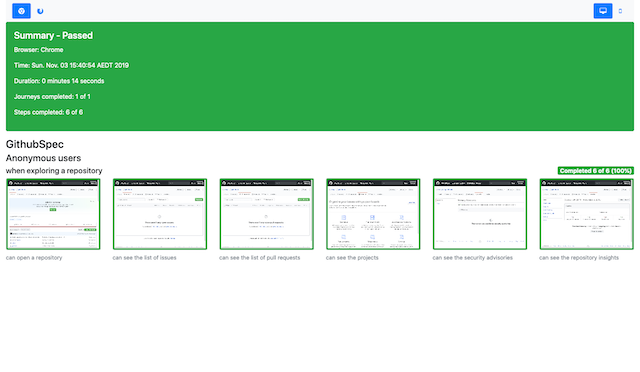
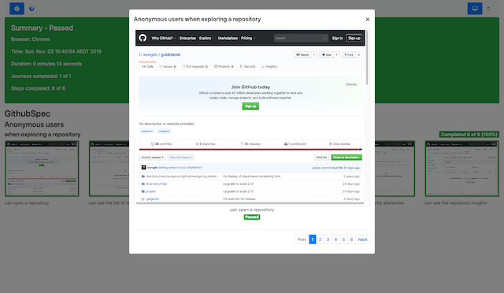

Guidebook
=========

Guidebook is an extension library and style guide for [Scalatest Selenium DSL](http://www.scalatest.org/user_guide/using_selenium)
for even simpler regression testing and producing a guidebook-style report for your tests.

 

Examples
========

[Sample project](https://github.com/wongelz/guidebook-examples/)

[Sample report](https://wongelz.github.io/guidebook-examples/index.html)

Usage
-----
1. Add the following to your build.sbt

```

resolvers += Resolver.bintrayRepo("wongelz", "guidebook")

libraryDependencies ++= Seq(
  "com.github.wongelz"           %% "guidebook"                % "0.4.0"  % Test
)

testOptions in Test ++= Seq(
  Tests.Argument(TestFrameworks.ScalaTest, "-o"),
  Tests.Argument(TestFrameworks.ScalaTest, "-C", "com.github.wongelz.guidebook.GuidebookReporter")
)
```

(Optional) If parallel browser windows (suite executions) are causing problems

```
parallelExecution in Test := false

```

2. Your test classes should extend `Guidebook`

3. Run your tests using sbt. You need to specify a webdriver location for each browser you are testing.
eg. to test using Chrome and Firefox (gecko):

```
sbt -Dwebdriver.chrome.driver=/path/to/chromedriver -Dwebdriver.gecko.driver=/path/to/geckodriver test
```

4. Your test report will be available in `target/guidebook/index.html`.

Configuration
-------------

1. Changing the default screen size
```
testOptions in Test += Tests.Argument(TestFrameworks.ScalaTest, "-Dscreen.default.size=640x1024")
```

2. Additional screen sizes

Guidebook can resize the browser to different sizes at the conclusion of each test and take a screenshot at each size.

An additional report will be generated for each additional size, giving you view of how your site appears on different screen sizes.
Note that there is no test execution under these sizes.

Up to 5 additional sizes can be configured.

```
testOptions in Test ++= Seq(
  Tests.Argument(TestFrameworks.ScalaTest, "-Dscreen.1.size=640x1024"),
  Tests.Argument(TestFrameworks.ScalaTest, "-Dscreen.2.size=600x400"),
  ...
  Tests.Argument(TestFrameworks.ScalaTest, "-Dscreen.5.size=2000x1000")
)
```
